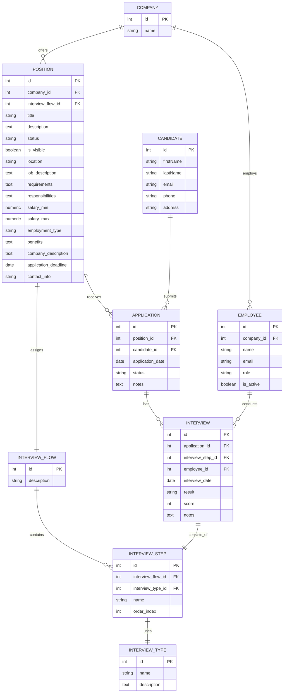

# Historial de Prompts 📑

## Modelo 🤖

- **LLM:** GPT-4.1
- **Versión:** 2024-06

---

## Categorías 🏷️

---

## Prompts del usuario 📝👤

**Prompt 1**:
Eres un experto DBA 

Tu misión es actualizar la base de datos con las nuevas entidades que nos permitan operar el flujo completo de aplicación para diversas posiciones.

Procede a convertir el siguiente ERD a un script SQL @schema_script.sql 

ERD:

Analiza la base de datos del código actual @schema.prisma  y @schema_script.sql generado y expande la estructura de datos usando las migraciones de Prisma, para ello genera un nuevo archivo llamado new_schema.prisma

Recuerda aplicar buenas practicas, como la definición de Indices y la normalización de la base datos, ya que el ERD proporcionado no cuenta con ello.

Por otra parte, utiliza herramientas visuales para bases de datos PostgreSQL como PGAdmin para verificar que puedes conectar, y que la estructura creada es correcta. 

También deberás verificar que se puedan guardar datos correctamente y realizar consultas (queries) de ejemplo

Adicionalmente, puedes revisar el contexto del proyecto en @README.md

**Prompt 2**:
comenta cada create de tabla y de indices en @schema_script.sql con una descripcion relevante

**Prompt 3**:
genera ejemplos de insercion para poblar las tablas con data dummy actualiza el script @data_script.sql 

**Prompt 4**:
genera consultas SQL relevantes que permitan validar el contenido de la BD y el rendimiento de queries. agrega las consultas en @queries_script.sql comenta todo lo necesario con descripciones relevantes

**Prompt 5**:
para evaluar correctamente el rendimiento de la BD necesito generar un volumen considerable de data dummy, actualiza @data_script.sql los datos deben ser lo mas realista posible

**Prompt 6**:
al generar el nuevo esquema no aplicaste buenas practicas de normalizacion. analiza @schema_script.sql y genera las tablas necesarias para aplicar la normalizacion y evitar redundancia de datos, actualiza todos los archivos involucrados para que queden acordes @schema.prisma @schema_script.sql @data_script.sql @queries_script.sql recuerda que la data dummy generada debe ser relevante y con volumen considerable para validar el rendimiento al generar las consultas

**Prompt 7**:
agrega mas volumen de datos @data_script.sql y agrega queries mas complejas para analisis avanzado @queries_script.sql al crear data nueva asegurate de respetar los id autogenerados ya existentes 

**Prompt 8**:
vamos a probar el nuevo esquema, levanta el backend y genera el nuevo schema, inserta los datos de @data_script.sql por ultimo dame el string de conexion para revisar la BD externamente 

**Prompt 9**:
actualiza @schema.prisma  para seguir buenas practicas de nomenclatura de nombres de tablas y campos, agrega el mapping de campos y tablas a nombres con minuscula y palabras separadas por guion bajo "_" no modifiques los nombre de los models

**Prompt 10:**
genera de nuevo el schema, inserta los datos de @data_script.sql en BD

**Prompt 11:**
realiza un reset completo de prisma y genera el esquema nuevamente. necesito que los nombres de tablas y campos se generen con los nombres de mapeo y no de modelos, asegurate de forzar el reset para generar el nuevo esquema desde 0

**Prompt 12**:
no me esta funcionando el nombre de los mapeos en @schema.prisma modifica los archivos .sql y modificalos para que tengan los mismos nombres de modelos y campos entre comilla por ejemplo "Company"

---

## Conclusiones 🏁